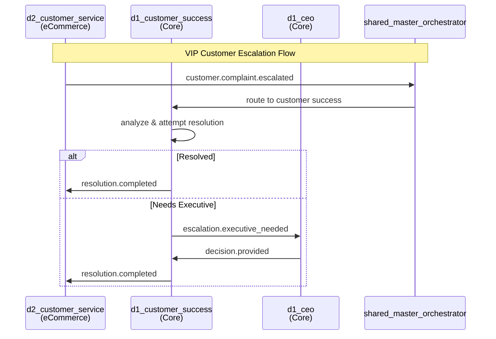
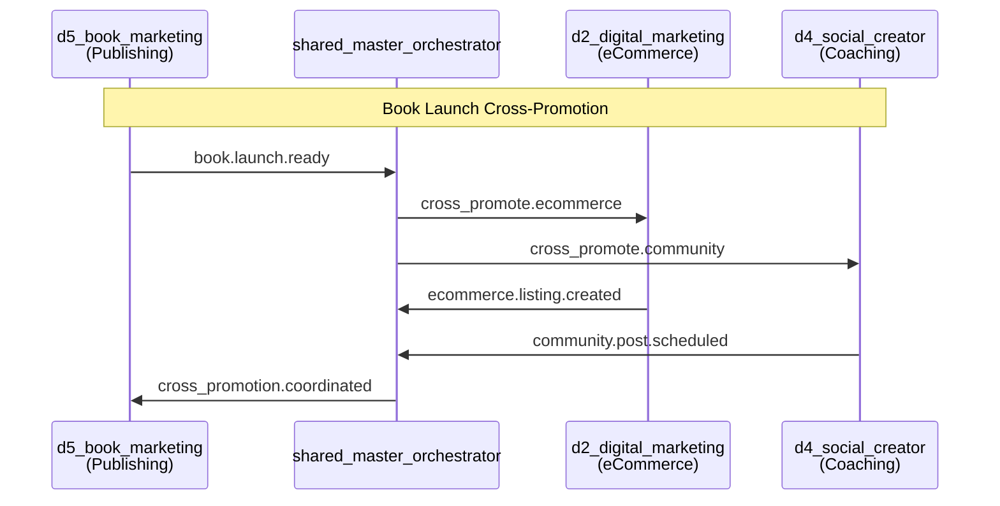
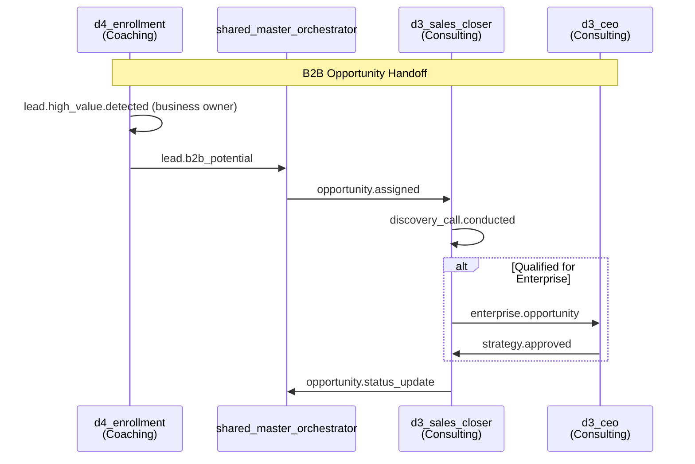
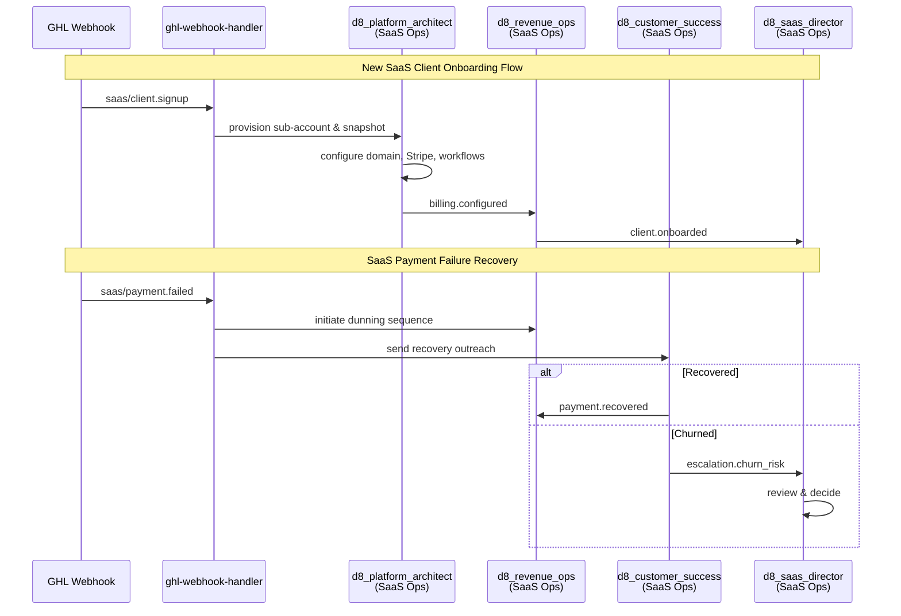
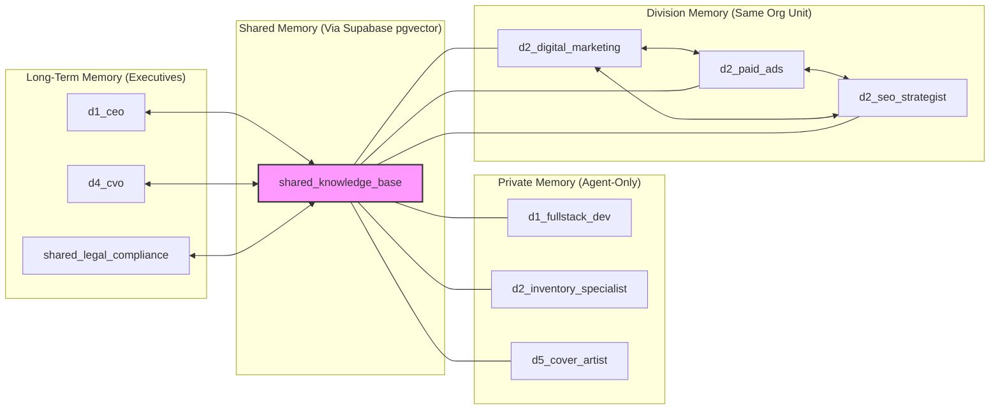
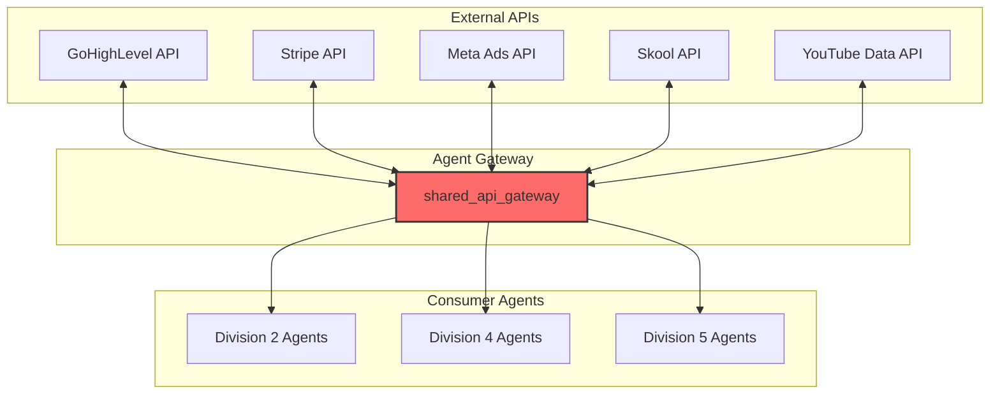

# Agent Communication Map — Open Claw 90-Agent Architecture

> **Truth J Blue LLC** | Multi-Agent System Inter-Agent Routing Specification

---

## Overview

This document defines how 90 AI agents communicate across 8 organizational divisions. The architecture uses a **hybrid orchestration model**:

- **Inngest Events** for cross-division communication (scalable, event-sourced)
- **OpenClaw Workspace Model** for within-division isolation (familiar, memory-isolated)

---

## Hub Nodes (High-Connectivity Agents)

These agents serve as primary routing points with the highest number of connections:

| Hub Agent | Division | Inbound Sources | Outbound Targets | Role |
|-----------|----------|-----------------|------------------|------|
| `shared_master_orchestrator` | Shared Services | All division heads | Any agent | Central event router |
| `d1_ceo` | Core Operations | All executives + escalations | Board, Orchestrator | Final decision authority |
| `d1_cto` | Core Operations | All tech specialists | CEO, API Gateway | Technical oversight |
| `d1_cmo` | Core Operations | All marketing managers | CEO, Division marketing | Brand strategy |
| `shared_data_analytics` | Shared Services | All divisions (metrics events) | Executive dashboards | Metrics aggregation |
| `shared_knowledge_base` | Shared Services | All agents (queries) | All agents (context) | Institutional memory |
| `d8_saas_director` | SaaS Operations | All D8 specialists + MO | D1_CEO, D1_CTO, MO | SaaS portfolio command |

---

## Division Hierarchy Diagram

```mermaid
graph TB
    subgraph "Master Control"
        MO[shared_master_orchestrator<br/>Master Orchestrator]
    end

    subgraph "Division 1 — Core Operations"
        D1_CEO[d1_ceo<br/>CEO]
        D1_CTO[d1_cto<br/>CTO]
        D1_CMO[d1_cmo<br/>CMO]
        D1_PDM[d1_product_dev_manager<br/>Product Dev Manager]
        D1_FSD[d1_fullstack_dev<br/>Full-Stack Dev]
        D1_UX[d1_ux_designer<br/>UX Designer]
        D1_SM[d1_sales_manager<br/>Sales Manager]
        D1_CS[d1_customer_success<br/>Customer Success]
        D1_DO[d1_devops<br/>DevOps]
        D1_DA[d1_data_analyst<br/>Data Analyst]
    end

    subgraph "Division 2 — eCommerce"
        D2_DIR[d2_director<br/>eCommerce Director]
        D2_STM[d2_store_manager<br/>Store Manager]
        D2_DMM[d2_digital_marketing<br/>Digital Marketing]
        D2_SEO[d2_seo_strategist<br/>SEO Strategist]
        D2_GD[d2_graphic_designer<br/>Graphic Designer]
        D2_CW[d2_copywriter<br/>Copywriter]
        D2_INV[d2_inventory_specialist<br/>Inventory Specialist]
        D2_CSR[d2_customer_service<br/>Customer Service]
        D2_ADS[d2_paid_ads<br/>Paid Ads]
        D2_WD[d2_web_dev<br/>Web Developer]
    end

    subgraph "Division 3 — Consulting"
        D3_CEO[d3_ceo<br/>Principal Consultant]
        D3_BD[d3_biz_dev<br/>Business Dev]
        D3_LS[d3_lead_strategist<br/>Lead Strategist]
        D3_OM[d3_ops_manager<br/>Ops Manager]
        D3_MB[d3_marketing_brand<br/>Marketing & Brand]
        D3_CR[d3_client_relations<br/>Client Relations]
        D3_SC[d3_sales_closer<br/>Sales Closer]
        D3_TL[d3_thought_leadership<br/>Thought Leadership]
        D3_BA[d3_business_analyst<br/>Business Analyst]
        D3_AC[d3_admin_coordinator<br/>Admin Coordinator]
    end

    subgraph "Division 4 — Coaching"
        D4_CVO[d4_cvo<br/>Chief Visionary Officer]
        D4_CH[d4_curriculum_head<br/>Curriculum Head]
        D4_LC[d4_lead_coach<br/>Lead Coach]
        D4_CM[d4_community_manager<br/>Community Manager]
        D4_FS[d4_funnel_strategist<br/>Funnel Strategist]
        D4_SOC[d4_social_creator<br/>Social Creator]
        D4_VP[d4_video_production<br/>Video Production]
        D4_EN[d4_enrollment<br/>Enrollment]
        D4_TA[d4_tech_automation<br/>Tech Automation]
        D4_CE[d4_client_experience<br/>Client Experience]
    end

    subgraph "Division 5 — Publishing"
        D5_PUB[d5_publisher<br/>Publisher]
        D5_ACQ[d5_acquisitions<br/>Acquisitions Editor]
        D5_ME[d5_managing_editor<br/>Managing Editor]
        D5_BM[d5_book_marketing<br/>Book Marketing]
        D5_CA[d5_cover_artist<br/>Cover Artist]
        D5_CW[d5_copywriter<br/>Copywriter]
        D5_PR[d5_pr_media<br/>PR & Media]
        D5_DD[d5_digital_distribution<br/>Distribution]
        D5_SA[d5_sales_affiliate<br/>Sales & Affiliate]
        D5_AR[d5_author_relations<br/>Author Relations]
    end

    subgraph "Division 6 — Nonprofit"
        D6_ED[d6_executive_director<br/>Executive Director]
        D6_COO[d6_coo<br/>COO]
        D6_DD[d6_dev_director<br/>Development Director]
        D6_GW[d6_grant_writer<br/>Grant Writer]
        D6_PD[d6_program_director<br/>Program Director]
        D6_OR[d6_outreach<br/>Outreach]
        D6_VO[d6_volunteer<br/>Volunteer Coordinator]
        D6_COM[d6_communications<br/>Communications]
        D6_FIN[d6_finance<br/>Finance]
        D6_BL[d6_board_liaison<br/>Board Liaison]
    end

    subgraph "Division 7 — Shared Services"
        SH_LC[shared_legal_compliance<br/>Legal & Compliance]
        SH_DA[shared_data_analytics<br/>Data & Analytics Hub]
        SH_KB[shared_knowledge_base<br/>Knowledge Base]
        SH_AG[shared_api_gateway<br/>API Gateway]
    end

    %% Master Orchestrator connections
    MO --> D1_CEO
    MO --> D2_DIR
    MO --> D3_CEO
    MO --> D4_CVO
    MO --> D5_PUB
    MO --> D6_ED
    MO --> D8_DIR
    MO --> D9_DIR

    subgraph "Division 9 — Online Store (Books & Merch)"
        D9_DIR[d9_store_director<br/>Online Store Director]
        D9_OS[d9_offer_strategist<br/>Offer & Pricing Psychologist]
        D9_WD[d9_web_designer<br/>WordPress/Divi UX Designer]
        D9_WPD[d9_wp_developer<br/>WordPress/WooCommerce Developer]
        D9_SC[d9_sales_copywriter<br/>Sales Copywriter & Persuasion]
        D9_MER[d9_merchandiser<br/>Book & Merch Catalog Manager]
        D9_SP[d9_social_promoter<br/>Social Media & Promotions]
        D9_CX[d9_customer_experience<br/>Store Customer Experience]
        D9_AN[d9_analytics<br/>Store Analytics & Conversion]
        D9_SEO[d9_seo_content<br/>Store SEO & Content]
    end

    subgraph "Division 8 — SaaS Operations"
        D8_DIR[d8_saas_director<br/>SaaS Operations Director]
        D8_PA[d8_platform_architect<br/>Platform & Auth Architect]
        D8_FE[d8_funnel_engineer<br/>Funnel & Website Engineer]
        D8_AA[d8_automation_architect<br/>Workflow & Automation]
        D8_MD[d8_membership_director<br/>Course & Membership]
        D8_CM[d8_community_manager<br/>Community & Engagement]
        D8_CRM[d8_crm_ops<br/>CRM & Conversational AI]
        D8_REV[d8_revenue_ops<br/>E-Commerce & Revenue]
        D8_MA[d8_marketing_automation<br/>Marketing & Lead Gen]
        D8_CO[d8_content_ops<br/>Content & Assets]
        D8_CS[d8_customer_success<br/>Customer Support]
        D8_CA[d8_compliance_auditor<br/>System Auditing]
        D8_IE[d8_integration_engineer<br/>Orchestration & Integration]
    end

    %% Division 1 hierarchy
    D1_CEO --> D1_CTO
    D1_CEO --> D1_CMO
    D1_CEO --> D1_PDM
    D1_CTO --> D1_FSD
    D1_CTO --> D1_DO
    D1_CTO --> D1_UX
    D1_CMO --> D1_SM
    D1_CMO --> D1_CS
    D1_PDM --> D1_DA

    %% Division 2 hierarchy
    D2_DIR --> D2_STM
    D2_DIR --> D2_DMM
    D2_STM --> D2_INV
    D2_STM --> D2_CSR
    D2_STM --> D2_WD
    D2_DMM --> D2_SEO
    D2_DMM --> D2_ADS
    D2_DMM --> D2_GD
    D2_DMM --> D2_CW

    %% Division 3 hierarchy
    D3_CEO --> D3_BD
    D3_CEO --> D3_LS
    D3_CEO --> D3_OM
    D3_BD --> D3_SC
    D3_LS --> D3_BA
    D3_OM --> D3_AC
    D3_OM --> D3_CR
    D3_OM --> D3_MB
    D3_MB --> D3_TL

    %% Division 4 hierarchy
    D4_CVO --> D4_CH
    D4_CVO --> D4_CM
    D4_CVO --> D4_FS
    D4_CH --> D4_LC
    D4_CH --> D4_TA
    D4_FS --> D4_SOC
    D4_FS --> D4_EN
    D4_CM --> D4_CE
    D4_SOC --> D4_VP

    %% Division 5 hierarchy
    D5_PUB --> D5_ACQ
    D5_PUB --> D5_BM
    D5_PUB --> D5_DD
    D5_ACQ --> D5_ME
    D5_ACQ --> D5_AR
    D5_ME --> D5_CW
    D5_ME --> D5_CA
    D5_BM --> D5_PR
    D5_BM --> D5_SA

    %% Division 6 hierarchy
    D6_ED --> D6_COO
    D6_ED --> D6_DD
    D6_ED --> D6_BL
    D6_ED --> D6_COM
    D6_COO --> D6_PD
    D6_COO --> D6_FIN
    D6_COO --> D6_VO
    D6_DD --> D6_GW
    D6_PD --> D6_OR

    %% Shared services connections
    SH_AG --> D1_DO
    SH_DA --> D1_DA
    SH_LC --> D1_CEO
    SH_KB --> MO

    %% Division 8 hierarchy
    D8_DIR --> D8_PA
    D8_DIR --> D8_REV
    D8_DIR --> D8_CA
    D8_DIR --> D8_IE
    D8_PA --> D8_FE
    D8_PA --> D8_AA
    D8_PA --> D8_CRM
    D8_REV --> D8_MA
    D8_REV --> D8_MD
    D8_CA --> D8_CS
    D8_IE --> D8_CO
    D8_IE --> D8_CM

    %% Division 8 cross-division wiring
    D8_DIR --> D1_CEO
    D8_DIR --> D1_CTO
    D8_REV --> D1_SM
    D8_MA --> D1_CMO
    D8_CS --> D1_CS
    D8_CO --> D5_PUB
    D8_CA --> SH_LC

    %% Division 9 hierarchy
    D9_DIR --> D9_OS
    D9_DIR --> D9_WD
    D9_DIR --> D9_MER
    D9_DIR --> D9_CX
    D9_DIR --> D9_AN
    D9_OS --> D9_SC
    D9_OS --> D9_SP
    D9_WD --> D9_WPD
    D9_WD --> D9_SEO

    %% Division 9 cross-division wiring
    D9_DIR --> D1_CEO
    D9_DIR --> D2_DIR
    D9_DIR --> D5_PUB
    D9_OS --> D4_CVO
    D9_OS --> D5_BM
    D9_MER --> D5_DD
    D9_SP --> D4_SOC
    D9_SP --> D2_DMM
    D9_SEO --> D2_SEO
    D9_WPD --> D1_FSD

    style MO fill:#ff6b6b,stroke:#333,stroke-width:3px
    style D1_CEO fill:#4ecdc4,stroke:#333,stroke-width:2px
    style D2_DIR fill:#45b7d1,stroke:#333,stroke-width:2px
    style D3_CEO fill:#96ceb4,stroke:#333,stroke-width:2px
    style D4_CVO fill:#ffeaa7,stroke:#333,stroke-width:2px
    style D5_PUB fill:#dda0dd,stroke:#333,stroke-width:2px
    style D6_ED fill:#98d8c8,stroke:#333,stroke-width:2px
    style D8_DIR fill:#ff9f43,stroke:#333,stroke-width:2px
    style D9_DIR fill:#e056fd,stroke:#333,stroke-width:2px
```



---

## Cross-Division Event Flows









---

## Event Types & Routing Rules

### Inngest Event Schema

```typescript
interface AgentEvent {
  name: string;                    // Event name (e.g., "agent.invoke", "customer.complaint.escalated")
  data: {
    source_agent: string;         // agent_id of sender
    target_agent?: string;        // Optional specific target
    target_division?: string;     // Optional division routing
    payload: Record<string, any>; // Event-specific data
    priority: "low" | "normal" | "high" | "critical";
    requires_response: boolean;
    correlation_id: string;       // For tracking related events
  };
  ts: number;                     // Unix timestamp
}
```

### Event Routing Table

| Event Name | Source Division | Target Division | Router | Priority |
|------------|-----------------|-----------------|--------|----------|
| `customer.complaint.escalated` | D2 | D1 | Master Orchestrator | high |
| `book.launch.ready` | D5 | D2, D4 | Master Orchestrator | normal |
| `lead.high_value.detected` | D4 | D3 | Master Orchestrator | high |
| `compliance.review.required` | Any | D7 (Shared) | Direct | high |
| `metrics.daily.aggregate` | All | D7 (Shared) | Direct | low |
| `agent.health.check` | D7 | All | Master Orchestrator | low |
| `escalation.executive_needed` | Any | D1 CEO | Direct | critical |
| `knowledge.query` | Any | D7 Knowledge Base | Direct | normal |
| `api.request.failed` | Any | D7 API Gateway | Direct | high |
| `grant.opportunity.identified` | D6 | D6 | Within-division | normal |
| `coaching.session.scheduled` | D4 | D4 | Within-division | normal |
| `product.listing.created` | D2 | D5 | Master Orchestrator | normal |
| `saas/client.signup` | D8 | D8 | Webhook Handler | high |
| `saas/payment.failed` | D8 | D8 | Webhook Handler | critical |
| `saas/payment.received` | D8 | D8 | Webhook Handler | normal |
| `saas/subscription.cancelled` | D8 | D8 + D1 | Webhook Handler | high |
| `saas/usage.threshold` | D8 | D8 | Webhook Handler | normal |
| `saas/funnel.published` | D8 | D8 | Inngest | normal |
| `saas/client.churn` | D8 | D8 + D1 | Inngest | critical |

---

## Escalation Paths

### Division 1 — Core Operations
```
d1_fullstack_dev → d1_product_dev_manager → d1_cto → d1_ceo → shared_master_orchestrator
d1_devops → d1_cto → d1_ceo
d1_ux_designer → d1_product_dev_manager → d1_cto
d1_data_analyst → d1_product_dev_manager → d1_cto
d1_sales_manager → d1_cmo → d1_ceo
d1_customer_success → d1_cmo → d1_ceo
```

### Division 2 — eCommerce
```
d2_customer_service → d2_store_manager → d2_director → d1_ceo
d2_inventory_specialist → d2_store_manager → d2_director
d2_graphic_designer → d2_digital_marketing → d2_director
d2_copywriter → d2_digital_marketing → d2_director
d2_seo_strategist → d2_digital_marketing → d2_director
d2_paid_ads → d2_digital_marketing → d2_director
d2_web_dev → d2_store_manager → d2_director
```

### Division 3 — Consulting
```
d3_admin_coordinator → d3_ops_manager → d3_ceo → d1_ceo
d3_business_analyst → d3_lead_strategist → d3_ceo
d3_sales_closer → d3_biz_dev → d3_ceo
d3_thought_leadership → d3_marketing_brand → d3_ceo
d3_client_relations → d3_ops_manager → d3_ceo
```

### Division 4 — Coaching & Community
```
d4_client_experience → d4_lead_coach → d4_cvo → d1_ceo
d4_video_production → d4_social_creator → d4_funnel_strategist → d4_cvo
d4_enrollment → d4_funnel_strategist → d4_cvo
d4_tech_automation → d4_curriculum_head → d4_cvo
d4_community_manager → d4_cvo
```

### Division 5 — Publishing
```
d5_author_relations → d5_acquisitions → d5_publisher → d1_ceo
d5_cover_artist → d5_managing_editor → d5_publisher
d5_copywriter → d5_book_marketing → d5_publisher
d5_pr_media → d5_book_marketing → d5_publisher
d5_sales_affiliate → d5_book_marketing → d5_publisher
d5_digital_distribution → d5_publisher
```

### Division 6 — Nonprofit
```
d6_volunteer → d6_coo → d6_executive_director → d1_ceo
d6_outreach → d6_program_director → d6_coo → d6_executive_director
d6_grant_writer → d6_dev_director → d6_executive_director
d6_finance → d6_coo → d6_executive_director
d6_board_liaison → d6_executive_director
d6_communications → d6_executive_director
```

### Shared Services
```
shared_api_gateway → d1_devops → d1_cto
shared_data_analytics → d1_cto
shared_knowledge_base → d1_cto
shared_legal_compliance → d1_ceo
shared_master_orchestrator → d1_ceo
```

### Division 8 — SaaS Operations
```
d8_customer_success → d8_compliance_auditor → d8_saas_director → d1_ceo
d8_community_manager → d8_integration_engineer → d8_saas_director
d8_content_ops → d8_integration_engineer → d8_saas_director
d8_funnel_engineer → d8_platform_architect → d8_saas_director
d8_automation_architect → d8_platform_architect → d8_saas_director
d8_crm_ops → d8_platform_architect → d8_saas_director
d8_marketing_automation → d8_revenue_ops → d8_saas_director
d8_membership_director → d8_revenue_ops → d8_saas_director
d8_compliance_auditor → shared_legal_compliance
```

### Division 9 — Online Store (Books & Merch)
```
d9_customer_experience → d9_store_director → d1_ceo
d9_seo_content → d9_web_designer → d9_store_director
d9_wp_developer → d9_web_designer → d9_store_director
d9_sales_copywriter → d9_offer_strategist → d9_store_director
d9_social_promoter → d9_offer_strategist → d9_store_director
d9_merchandiser → d9_store_director → d1_ceo
d9_analytics → d9_store_director → d1_ceo
```

---

## Agent Connectivity Matrix

### High-Connectivity Agents (>5 dependencies)

| Agent | Inbound | Outbound | Total | Hub Score |
|-------|---------|----------|-------|-----------|
| `shared_master_orchestrator` | 6 | 8 | 14 | ⭐⭐⭐⭐⭐ |
| `d1_ceo` | 9 | 4 | 13 | ⭐⭐⭐⭐⭐ |
| `d1_cto` | 7 | 4 | 11 | ⭐⭐⭐⭐ |
| `d1_cmo` | 6 | 4 | 10 | ⭐⭐⭐⭐ |
| `shared_knowledge_base` | 75 | 75 | 150 | ⭐⭐⭐⭐⭐ |
| `d4_cvo` | 5 | 4 | 9 | ⭐⭐⭐ |
| `d2_director` | 5 | 3 | 8 | ⭐⭐⭐ |
| `d8_saas_director` | 12 | 5 | 17 | ⭐⭐⭐⭐⭐ |
| `d9_store_director` | 6 | 5 | 11 | ⭐⭐⭐⭐ |

---

## Memory Sharing Topology



### Memory Types by Agent Count

| Memory Type | Agent Count | Use Case |
|-------------|-------------|----------|
| `long-term` | 28 | Executives, managers with relationship context |
| `shared` | 22 | Teams needing collaborative context |
| `short-term` | 18 | Task-focused specialists |
| `none` | 7 | Stateless utility agents |

---

## Real-Time Status Dashboard Events

The `shared_master_orchestrator` emits periodic health events:

```typescript
// Emitted every hour at minute 0
{
  name: "agent.health.summary",
  data: {
    total_agents: 75,
    healthy: 73,
    degraded: 2,
    offline: 0,
    last_check_ts: 1710201600000,
    divisions: {
      division_1: { healthy: 10, degraded: 0 },
      division_2: { healthy: 10, degraded: 0 },
      division_3: { healthy: 9, degraded: 1 },
      division_4: { healthy: 10, degraded: 0 },
      division_5: { healthy: 9, degraded: 1 },
      division_6: { healthy: 10, degraded: 0 },
      division_7: { healthy: 5, degraded: 0 }
    }
  }
}
```

---

## Integration Points with External Systems



---

## Implementation Notes

1. **Inngest Function Naming**: All cross-division events use `agent/{source_division}/{event_name}` naming convention
2. **Telegram Delivery**: Only 23 agents have `telegram_delivery: true` — all executives and critical specialists
3. **Cron Schedules**: 18 agents have scheduled tasks, primarily morning reports (7 AM CT)
4. **Rate Limiting**: API Rate Governor enforces per-provider limits (GHL: 20 req/min, 5 concurrent; OpenAI: 50 req/min; Anthropic: 30 req/min) with circuit breaker and priority-based backoff. See `lib/api-rate-governor.ts`
5. **Failover**: If division head is unreachable, Master Orchestrator routes to `d1_ceo` after 3 retries

---

*Generated: 2026-03-12 | Version: 1.0.0 | Author: Open Claw Architecture Team*
