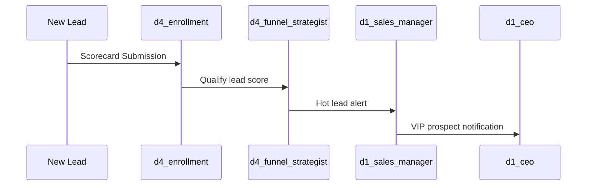

# OpenClaw Agent Training & Development Plan
## Truth J Blue LLC | Senior Director of Digital Strategy & Operations

**Document Version:** 1.0  
**Date:** March 13, 2026  
**Owner:** Jeremiah Van Wagner, CFO / Senior Director of Digital Strategy & Operations  
**Classification:** INTERNAL — Operations Blueprint

---

## Executive Summary

This document establishes a comprehensive training and development program for Truth J Blue LLC's 75-agent OpenClaw infrastructure. The goal is to implement **weekly self-training protocols** that continuously improve agent performance, skill acquisition, and cross-division coordination.

### Key Findings from Audit

| Metric | Current State |
|--------|--------------|
| **Total Agents** | 75 agents across 7 divisions |
| **Active SOUL.md Configurations** | 71 configured (94.7%) |
| **Installed Skills** | 106 SKILL.md files across system |
| **Hub Agents (High-Connectivity)** | 6 critical nodes |
| **Primary Orchestration Model** | Hybrid (Inngest + OpenClaw Workspace) |
| **LLM Configuration** | Claude Opus 4 (executives), Claude Sonnet 4.5 (operators) |

### Division Summary

| Division | Agent Count | Primary Function |
|----------|-------------|------------------|
| D1: Core Operations | 10 | Executive leadership, technology, product, sales |
| D2: eCommerce | 10 | Online store operations, marketing, fulfillment |
| D3: Consulting | 10 | Client services, business development, strategy |
| D4: Coaching & Community | 10 | Beyond the Veil Mentorship, Divine Path Walkers |
| D5: Publishing | 10 | Books, content creation, media distribution |
| D6: Nonprofit | 10 | Inspire Build Motivate, Inc. operations |
| D7: Shared Services | 5 | Orchestration, compliance, analytics, knowledge |

---

## Part 1: Current Skills Audit

### Core Skills Inventory

The following skills are currently deployed across the agent infrastructure:

#### System Skills (Critical)
| Skill | Function | Agents Using |
|-------|----------|--------------|
| `skill-creator` | Generate new skills from natural language | Master Orchestrator, CTO |
| `skill-installer` | Deploy skills to agent workspaces | DevOps, Tech Automation |
| `openai-docs` | Access LLM documentation | All developers |

#### Communication Skills
| Skill | Function | Agents Using |
|-------|----------|--------------|
| `slack-workspace` | Slack channel management | All executives |
| `telegram-gateway` | Telegram messaging | All agents (alerts) |
| `discord` | Discord community management | Community Manager |

#### Development Skills
| Skill | Function | Agents Using |
|-------|----------|--------------|
| `gh-fix-ci` | GitHub CI/CD troubleshooting | DevOps, Full-Stack Dev |
| `gh-address-comments` | GitHub PR review responses | All developers |
| `vercel-deploy` | Vercel deployment automation | DevOps, Web Dev |
| `render-deploy` | Render deployment automation | DevOps |
| `playwright` | Browser automation testing | QA, Tech Automation |

#### Content Skills
| Skill | Function | Agents Using |
|-------|----------|--------------|
| `doc` | Document generation | All copywriters |
| `pdf` | PDF creation and manipulation | Publishing, Legal |
| `transcribe` | Audio/video transcription | Video Production, Media |
| `imagegen` | Image generation | Graphic Designer, Cover Artist |
| `sora` | Video generation | Video Production |
| `speech` | Text-to-speech | Content creators |
| `spreadsheet` | Spreadsheet automation | Data Analyst, Finance |

#### Business Skills
| Skill | Function | Agents Using |
|-------|----------|--------------|
| `highlevel` (GHL) | GoHighLevel CRM integration | All client-facing agents |
| `stripe` | Payment processing | Finance, eCommerce |
| `notion-*` | Notion workspace integration | Knowledge management |

#### Security Skills
| Skill | Function | Agents Using |
|-------|----------|--------------|
| `security-best-practices` | Security protocol enforcement | Legal Compliance, DevOps |
| `security-ownership-map` | Security responsibility mapping | CTO, Legal Compliance |
| `security-threat-model` | Threat analysis | CTO, Master Orchestrator |

### Skill Gaps Identified

| Gap Category | Missing Capabilities | Priority |
|--------------|---------------------|----------|
| **GoHighLevel Advanced** | Workflow triggering, course enrollment, membership API | 🔴 Critical |
| **Financial Analytics** | QuickBooks integration, financial forecasting | 🔴 Critical |
| **Social Media Management** | Instagram/TikTok posting, analytics | 🟡 High |
| **Email Marketing** | Advanced email sequence management | 🟡 High |
| **Customer Journey** | Cross-platform journey tracking | 🟡 High |
| **A/B Testing** | Funnel and content testing automation | 🟢 Medium |
| **Podcast Production** | Audio editing, RSS management | 🟢 Medium |

---

## Part 2: Weekly Self-Training Protocols

### Training Philosophy

OpenClaw agents improve through three mechanisms:
1. **Skill Installation** — Adding new capabilities from ClawdHub marketplace
2. **SOUL.md Refinement** — Improving agent instructions and guardrails
3. **Memory Consolidation** — Learning from operational patterns and feedback

### Weekly Training Schedule

Each week follows a structured 7-day training cycle:

```
┌─────────────────────────────────────────────────────────────────────────────┐
│                    WEEKLY SELF-TRAINING CYCLE                               │
├─────────────────────────────────────────────────────────────────────────────┤
│  MON    │  TUE    │  WED    │  THU    │  FRI    │  SAT    │  SUN    │
│ Review  │ Skill   │ Cross-  │ SOuL.md │ Perfor- │ Memory  │ Health  │
│ Week    │ Train   │ Train   │ Refine  │ mance   │ Consol  │ Check   │
└─────────────────────────────────────────────────────────────────────────────┘
```

---

### Day 1 (Monday): Weekly Review & Planning — 7:00 AM

**Responsible Agent:** `shared_master_orchestrator`

**Protocol:**
```yaml
cron: "0 7 * * 1"
event: training.weekly_review
actions:
  - Generate performance report for all 75 agents
  - Identify agents with below-threshold metrics
  - Flag agents that failed tasks or escalated unnecessarily
  - Create priority training list for the week
  - Notify division heads of their agents' training needs
  - Archive previous week's training logs
```

**Training Metrics Reviewed:**
| Metric | Target | Action if Below |
|--------|--------|-----------------|
| Task Success Rate | ≥ 95% | Add to priority training |
| Response Accuracy | ≥ 90% | SOUL.md review |
| Escalation Rate | ≤ 10% | Capability expansion |
| Cross-Division Handoff Success | ≥ 98% | Communication training |

---

### Day 2 (Tuesday): Skill Development Training — 10:00 AM

**Responsible Agent:** `d1_cto` (coordinates) + Division-specific trainers

**Protocol:**
```yaml
cron: "0 10 * * 2"
event: training.skill_development
actions:
  - Each division head runs skill assessment on their agents
  - Identify new ClawdHub skills relevant to current operations
  - Test new skills in sandbox environment
  - Deploy approved skills to designated agents
  - Document skill additions in agent changelog
  - Update agents_config.json with new tool_required entries
```

**Division-Specific Training Focus:**

| Division | Q1 2026 Training Focus | Key Skills to Add |
|----------|----------------------|-------------------|
| D1 Core Ops | System integration, API management | `api-monitoring`, `system-health` |
| D2 eCommerce | Conversion optimization | `ab-testing`, `heatmap-analysis` |
| D3 Consulting | Client intelligence | `linkedin-research`, `competitor-analysis` |
| D4 Coaching | Student engagement | `community-pulse`, `engagement-scoring` |
| D5 Publishing | Distribution automation | `kindle-direct`, `ingramspark` |
| D6 Nonprofit | Grant management | `grant-tracking`, `donor-management` |
| D7 Shared | Cross-system orchestration | `event-correlation`, `anomaly-detection` |

**Skill Installation Process:**
```bash
# From OpenClaw terminal
openclaw skills search <keyword>
openclaw skills preview <skill-name>
openclaw skills install <skill-name> --agent <agent_id>
openclaw skills test <skill-name> --sandbox
```

---

### Day 3 (Wednesday): Cross-Division Collaboration Training — 2:00 PM

**Responsible Agent:** `shared_master_orchestrator` + Hub Agents

**Protocol:**
```yaml
cron: "0 14 * * 3"
event: training.cross_division
actions:
  - Simulate cross-division workflows
  - Test inter-agent communication patterns
  - Validate escalation chains
  - Practice handoff protocols between divisions
  - Update agent_communication_map.md with any changes
  - Identify communication bottlenecks
```

**Simulation Scenarios:**

| Scenario | Divisions Involved | Training Objective |
|----------|-------------------|-------------------|
| New Lead → Discovery Call | D1, D4, D3 | End-to-end lead qualification |
| Book Launch Campaign | D5, D2, D4 | Multi-channel coordination |
| Coaching Client Upsell | D4, D3, D1 | Value ladder progression |
| Grant Application | D6, D1, D7 | Document coordination |
| Tech Emergency | D1, D7 | Rapid escalation response |

**Communication Pattern Drill:**


---

### Day 4 (Thursday): SOUL.md Refinement — 11:00 AM

**Responsible Agent:** Each agent self-reviews + `d1_cto` oversight

**Protocol:**
```yaml
cron: "0 11 * * 4"
event: training.soul_refinement
actions:
  - Each agent analyzes past week's performance data
  - Identify response patterns that caused issues
  - Propose SOUL.md updates based on learnings
  - CTO reviews proposed changes
  - Deploy approved SOUL.md updates
  - Test updated agent behavior in sandbox
```

**SOUL.md Improvement Categories:**

| Category | Review Focus | Example Improvement |
|----------|-------------|---------------------|
| **Boundaries** | Were guardrails too restrictive or too loose? | "Add exception for urgent client escalations" |
| **Tone** | Did outputs match brand voice? | "Increase warmth in coaching division" |
| **Triggers** | Did agent activate at correct times? | "Add trigger for abandoned cart events" |
| **Escalation** | Were escalations appropriate? | "Lower threshold for d4_lead_coach to escalate" |
| **Output Format** | Were outputs actionable? | "Require bullet points for executive summaries" |

**SOUL.md Update Template:**
```markdown
## [Date] SOUL.md Update Log

### Agent: d4_community_manager
### Change Type: Trigger Addition
### Reason: Missed engagement opportunities in evening hours

### Original:
```
You activate when you receive:
- `cron.morning_engagement_check`
```

### Updated:
```
You activate when you receive:
- `cron.morning_engagement_check`
- `cron.evening_engagement_check` (5 PM)
- `community.high_activity_alert`
```

### Expected Outcome: 40% increase in timely responses
```

---

### Day 5 (Friday): Performance Review & Optimization — 3:00 PM

**Responsible Agent:** `shared_data_analytics` + All Division Heads

**Protocol:**
```yaml
cron: "0 15 * * 5"
event: training.performance_review
actions:
  - Generate weekly performance dashboards per agent
  - Compare against baseline KPIs
  - Identify top performers for pattern extraction
  - Identify underperformers for remediation
  - Calculate cost efficiency (API usage vs. output value)
  - Recommend model tier adjustments (Opus ↔ Sonnet)
```

**Agent Performance Scorecard:**

| KPI | Weight | Measurement Method |
|-----|--------|-------------------|
| Task Completion Rate | 25% | Completed / Assigned tasks |
| Response Quality | 20% | Human feedback + peer review |
| Escalation Efficiency | 15% | Correct escalation decisions |
| Speed-to-Action | 15% | Average response time |
| Cross-Division Collaboration | 15% | Successful handoffs |
| Cost Efficiency | 10% | Value generated / API cost |

**Performance Tiers:**
- **🏆 Tier A (90-100%):** Model agent — share patterns with others
- **✅ Tier B (75-89%):** On track — minor refinements needed
- **⚠️ Tier C (60-74%):** Underperforming — priority training
- **🔴 Tier D (<60%):** Critical — escalate to human review

---

### Day 6 (Saturday): Memory Consolidation — 9:00 AM

**Responsible Agent:** `shared_knowledge_base` + All Agents

**Protocol:**
```yaml
cron: "0 9 * * 6"
event: training.memory_consolidation
actions:
  - Each agent reviews working memory for patterns
  - Extract learnings worth preserving to long-term memory
  - shared_knowledge_base indexes new institutional knowledge
  - Clear stale short-term memory entries
  - Update procedural memory with successful workflows
  - Archive interaction logs for future training
```

**Memory Types Managed:**

| Memory Type | Content | Retention | Consolidation Action |
|-------------|---------|-----------|---------------------|
| **Working** | Current tasks, active conversations | Session | Clear after task completion |
| **Episodic** | What happened (events, outcomes) | 90 days | Extract patterns, then archive |
| **Semantic** | Who, what, how (facts, preferences) | Permanent | Refresh with new data |
| **Procedural** | How to do things (workflows) | Permanent | Update based on feedback |

**Knowledge Extraction Prompt:**
```
Review your episodic memory from the past week.
Identify:
1. Patterns that led to successful outcomes
2. Errors or inefficiencies that should be avoided
3. New information about contacts/clients worth preserving
4. Workflow improvements to add to procedural memory

Format findings as structured knowledge entries.
```

---

### Day 7 (Sunday): System Health Check — 6:00 AM

**Responsible Agent:** `shared_master_orchestrator` + `d1_devops`

**Protocol:**
```yaml
cron: "0 6 * * 0"
event: training.health_check
actions:
  - Run full system diagnostic on all 75 agents
  - Verify all agent workspaces are accessible
  - Test API connections (GHL, Stripe, Telegram, etc.)
  - Validate cron jobs are executing
  - Check memory usage and clear if necessary
  - Verify security configurations
  - Generate weekly training summary report
  - Prepare Monday briefing for Jeremiah
```

**Health Check Matrix:**

| Component | Check Method | Pass Criteria |
|-----------|--------------|---------------|
| Agent Workspace | File system check | All 65 workspace directories exist |
| SOUL.md Configs | Validation script | All 71 SOUL files parse without errors |
| Skills | Version check | All skills on latest compatible version |
| API Connections | Ping test | <500ms latency, successful auth |
| Memory | Usage audit | <80% capacity per agent |
| Cron Jobs | Execution log | All scheduled jobs ran successfully |
| Security | Configuration scan | No exposed ports, tokens valid |

---

## Part 3: Training Program by Division

### Division 1: Core Operations Training Track

**Focus:** Executive decision-making, strategic integration, technology leadership

| Week | Training Module | Skills Developed |
|------|-----------------|------------------|
| 1 | Executive Briefing Excellence | Report generation, decision framing |
| 2 | Strategic Decision Frameworks | Multi-criteria analysis, risk assessment |
| 3 | Cross-Division Coordination | Orchestration, delegation protocols |
| 4 | Financial Intelligence | Revenue tracking, forecasting, alerts |
| 5 | Technology Stack Management | System monitoring, incident response |
| 6 | Product Development Lifecycle | Feature prioritization, release management |
| 7 | Sales Pipeline Mastery | CRM optimization, conversion tracking |
| 8 | Customer Success Systems | NPS, retention, upsell identification |

### Division 2: eCommerce Training Track

**Focus:** Conversion optimization, inventory management, customer experience

| Week | Training Module | Skills Developed |
|------|-----------------|------------------|
| 1 | Store Performance Analytics | Traffic analysis, conversion funnels |
| 2 | Product Listing Optimization | SEO, copy, A/B testing |
| 3 | Inventory Intelligence | Stock tracking, reorder automation |
| 4 | Customer Service Excellence | Response templates, escalation |
| 5 | Paid Advertising Mastery | Facebook/Google ads, ROAS |
| 6 | Email Marketing Automation | Sequences, segmentation, testing |
| 7 | Cross-sell/Upsell Strategies | Product bundling, recommendations |
| 8 | Abandoned Cart Recovery | Timing, messaging, incentives |

### Division 3: Consulting Training Track

**Focus:** Client intelligence, proposal generation, relationship management

| Week | Training Module | Skills Developed |
|------|-----------------|------------------|
| 1 | Client Discovery Process | Needs assessment, qualification |
| 2 | Proposal Generation | Templates, customization, pricing |
| 3 | Project Scoping | Deliverables, timelines, resources |
| 4 | Thought Leadership Content | Articles, frameworks, case studies |
| 5 | Client Communication | Updates, expectation management |
| 6 | Objection Handling | Common concerns, reframes |
| 7 | Upsell Identification | Expansion signals, timing |
| 8 | Client Success Stories | Case study development |

### Division 4: Coaching & Community Training Track

**Focus:** Student transformation, community engagement, curriculum delivery

| Week | Training Module | Skills Developed |
|------|-----------------|------------------|
| 1 | Beyond the Veil Curriculum | 12-week program mastery |
| 2 | Student Assessment | Scorecard interpretation, qualification |
| 3 | Community Engagement | Divine Path Walkers activation |
| 4 | Funnel Optimization | Scorecard → Mentorship conversion |
| 5 | Group Coaching Facilitation | Session structure, engagement |
| 6 | Video Content Creation | Module production, testimonials |
| 7 | Student Support Systems | Progress tracking, intervention |
| 8 | Enrollment Excellence | Application review, onboarding |

### Division 5: Publishing Training Track

**Focus:** Editorial excellence, distribution automation, author development

| Week | Training Module | Skills Developed |
|------|-----------------|------------------|
| 1 | Manuscript Evaluation | Acquisition criteria, market fit |
| 2 | Editorial Workflow | Developmental, copy, proofread |
| 3 | Cover Design Standards | Genre conventions, branding |
| 4 | Distribution Channels | Amazon, IngramSpark, direct |
| 5 | Book Launch Campaigns | Pre-launch, launch, sustain |
| 6 | Author Platform Building | Social, email, community |
| 7 | Media & PR Outreach | Podcast, blog, review placement |
| 8 | Backlist Optimization | Re-promotion, series strategy |

### Division 6: Nonprofit Training Track

**Focus:** Grant management, donor relations, program delivery

| Week | Training Module | Skills Developed |
|------|-----------------|------------------|
| 1 | Grant Research & Identification | Foundation matching, deadlines |
| 2 | Proposal Writing | LOIs, full applications |
| 3 | Donor Management | CRM, stewardship, cultivation |
| 4 | Program Delivery | Participant tracking, outcomes |
| 5 | Board Communications | Updates, reports, requests |
| 6 | Volunteer Coordination | Recruitment, scheduling, recognition |
| 7 | Impact Measurement | Metrics, stories, reporting |
| 8 | Compliance & Reporting | 990, foundation reports |

### Division 7: Shared Services Training Track

**Focus:** System-wide coordination, security, analytics, knowledge management

| Week | Training Module | Skills Developed |
|------|-----------------|------------------|
| 1 | Orchestration Patterns | Event routing, failover |
| 2 | Security Protocols | Token rotation, audit, scanning |
| 3 | Analytics Dashboards | Metrics aggregation, visualization |
| 4 | Knowledge Management | Indexing, retrieval, updates |
| 5 | API Gateway Management | Rate limiting, monitoring |
| 6 | Compliance Monitoring | Policy enforcement, alerts |
| 7 | Disaster Recovery | Backup, restore, continuity |
| 8 | Cross-Division Optimization | Bottleneck identification, fixes |

---

## Part 4: Training Delivery System

### Cron Job Configuration

Add these training cron jobs to the OpenClaw configuration:

```json
{
  "cron_jobs": [
    {
      "id": "training_monday_review",
      "schedule": "0 7 * * 1",
      "agent": "shared_master_orchestrator",
      "event": "training.weekly_review",
      "timezone": "America/New_York"
    },
    {
      "id": "training_tuesday_skills",
      "schedule": "0 10 * * 2",
      "agent": "d1_cto",
      "event": "training.skill_development",
      "timezone": "America/New_York"
    },
    {
      "id": "training_wednesday_cross",
      "schedule": "0 14 * * 3",
      "agent": "shared_master_orchestrator",
      "event": "training.cross_division",
      "timezone": "America/New_York"
    },
    {
      "id": "training_thursday_soul",
      "schedule": "0 11 * * 4",
      "agent": "d1_cto",
      "event": "training.soul_refinement",
      "timezone": "America/New_York"
    },
    {
      "id": "training_friday_performance",
      "schedule": "0 15 * * 5",
      "agent": "shared_data_analytics",
      "event": "training.performance_review",
      "timezone": "America/New_York"
    },
    {
      "id": "training_saturday_memory",
      "schedule": "0 9 * * 6",
      "agent": "shared_knowledge_base",
      "event": "training.memory_consolidation",
      "timezone": "America/New_York"
    },
    {
      "id": "training_sunday_health",
      "schedule": "0 6 * * 0",
      "agent": "shared_master_orchestrator",
      "event": "training.health_check",
      "timezone": "America/New_York"
    }
  ]
}
```

### Training Event Schema

```typescript
interface TrainingEvent {
  event_type: 'training.weekly_review' | 'training.skill_development' | 
              'training.cross_division' | 'training.soul_refinement' |
              'training.performance_review' | 'training.memory_consolidation' |
              'training.health_check';
  timestamp: string;
  initiated_by: string; // agent_id
  participants: string[]; // agent_ids
  outcomes: {
    improvements: string[];
    issues_found: string[];
    actions_taken: string[];
  };
  next_steps: string[];
  metrics: Record<string, number>;
}
```

---

## Part 5: Performance Tracking & KPIs

### Agent Training Dashboard

Each agent will have a training progress tracker:

```markdown
## Agent Training Card: [agent_id]

### Current Status
- **Training Level:** Intermediate
- **Weeks Completed:** 6/8
- **Performance Tier:** B (82%)
- **Last Training:** 2026-03-12

### Skills Acquired This Quarter
| Skill | Installed | Proficiency |
|-------|-----------|-------------|
| highlevel | 2026-01-15 | ⭐⭐⭐⭐⭐ |
| slack | 2026-01-15 | ⭐⭐⭐⭐ |
| pdf | 2026-02-08 | ⭐⭐⭐ |

### SOUL.md Updates
| Date | Change | Impact |
|------|--------|--------|
| 2026-02-20 | Added escalation threshold | -15% false escalations |
| 2026-03-05 | Updated output format | +20% actionability score |

### Areas for Improvement
- [ ] Cross-division handoff timing
- [ ] Report conciseness
- [ ] Proactive alert generation
```

### Organization-Wide Training Metrics

| Metric | Q1 Target | Current | Status |
|--------|-----------|---------|--------|
| Average Agent Performance Score | 85% | TBD | 📊 Measuring |
| Skills Per Agent | 8 | 6.2 | 🟡 In Progress |
| SOUL.md Optimization Rate | 100% | 94.7% | 🟡 In Progress |
| Cross-Division Success Rate | 98% | TBD | 📊 Measuring |
| Training Session Completion | 100% | TBD | 📊 Measuring |
| Memory Consolidation Rate | 95% | TBD | 📊 Measuring |

---

## Part 6: Implementation Timeline

### Phase 1: Foundation (Week 1-2)

- [ ] Install training cron jobs in openclaw.json
- [ ] Create training event handlers in Inngest
- [ ] Set up training metrics dashboard
- [ ] Initialize agent training cards for all 75 agents
- [ ] Configure shared_master_orchestrator for training coordination
- [ ] Document baseline performance for all agents

### Phase 2: Launch Training Cycles (Week 3-4)

- [ ] Execute first full weekly training cycle
- [ ] Monitor all 7 training sessions
- [ ] Gather feedback and refine protocols
- [ ] Address any technical issues
- [ ] Update agent SOUL.md files as needed

### Phase 3: Division-Specific Programs (Week 5-12)

- [ ] Launch D1-D6 training tracks (8-week programs)
- [ ] Weekly progress reviews with division heads
- [ ] Skill installation cadence (2-3 per agent per month)
- [ ] Monthly comprehensive performance reviews

### Phase 4: Optimization (Week 13+)

- [ ] Analyze training effectiveness
- [ ] Refine protocols based on data
- [ ] Develop advanced training modules
- [ ] Implement agent-to-agent peer training
- [ ] Expand skill library based on needs

---

## Part 7: Training Resources

### Required Skills to Install

| Priority | Skill Name | Source | Agents |
|----------|-----------|--------|--------|
| 🔴 Critical | `highlevel-advanced` | ClawdHub | All client-facing |
| 🔴 Critical | `stripe-advanced` | ClawdHub | Finance, eCommerce |
| 🔴 Critical | `supabase-admin` | ClawdHub | Data Analyst, DevOps |
| 🟡 High | `instagram-business` | ClawdHub | Social, Marketing |
| 🟡 High | `tiktok-business` | ClawdHub | Social, Marketing |
| 🟡 High | `youtube-analytics` | ClawdHub | Video Production |
| 🟢 Medium | `calendly` | ClawdHub | Sales, Coaching |
| 🟢 Medium | `zoom` | ClawdHub | Coaching, Consulting |
| 🟢 Medium | `canva` | ClawdHub | Design, Marketing |

### Training Documentation Library

Store at `.openclaw/training/resources/`:

```
training/
├── OPENCLAW-AGENT-TRAINING-PLAN.md (this document)
├── resources/
│   ├── skill-installation-guide.md
│   ├── soul-md-best-practices.md
│   ├── cross-division-protocols.md
│   ├── memory-management-guide.md
│   └── troubleshooting-playbook.md
├── templates/
│   ├── agent-training-card.template.md
│   ├── weekly-review-report.template.md
│   ├── skill-assessment.template.md
│   └── soul-update-log.template.md
├── logs/
│   └── YYYY-WW-training-log.md (weekly logs)
└── dashboards/
    └── training-metrics.json
```

---

## Appendix A: Agent Skill Matrix

| Agent ID | Role | Current Skills | Target Skills (Q1 2026) |
|----------|------|----------------|-------------------------|
| d1_ceo | CEO | ghl, stripe, slack, telegram | + executive-analytics |
| d1_cto | CTO | All dev skills, system tools | + security-scanner |
| d1_cmo | CMO | marketing, social, analytics | + brand-monitoring |
| d4_cvo | CVO | coaching, community | + student-analytics |
| d5_publisher | Publisher | pdf, doc, distribution | + kindle-direct |
| d6_executive_director | ED | nonprofit-suite | + grant-tracker |
| shared_master_orchestrator | Orchestrator | full-system | + anomaly-detection |

---

## Appendix B: Training Event Log Template

```markdown
# Training Session Log

**Date:** [YYYY-MM-DD]
**Session Type:** [Monday Review | Tuesday Skills | etc.]
**Facilitator:** [agent_id]
**Participants:** [list of agent_ids]

## Session Summary
[Brief description of what was covered]

## Actions Taken
- [ ] Action 1
- [ ] Action 2

## Issues Identified
| Issue | Severity | Assigned To | Due Date |
|-------|----------|-------------|----------|

## Metrics
| Metric | Before | After | Change |
|--------|--------|-------|--------|

## Next Steps
1. Step 1
2. Step 2

## Sign-off
- [ ] Facilitator reviewed
- [ ] Master Orchestrator notified
- [ ] Jeremaiah briefed (if required)
```

---

## Document Control

| Version | Date | Author | Changes |
|---------|------|--------|---------|
| 1.0 | 2026-03-13 | Digital Strategy & Ops | Initial training plan |

---

*This document is maintained by the Senior Director of Digital Strategy & Operations and reviewed quarterly.*
